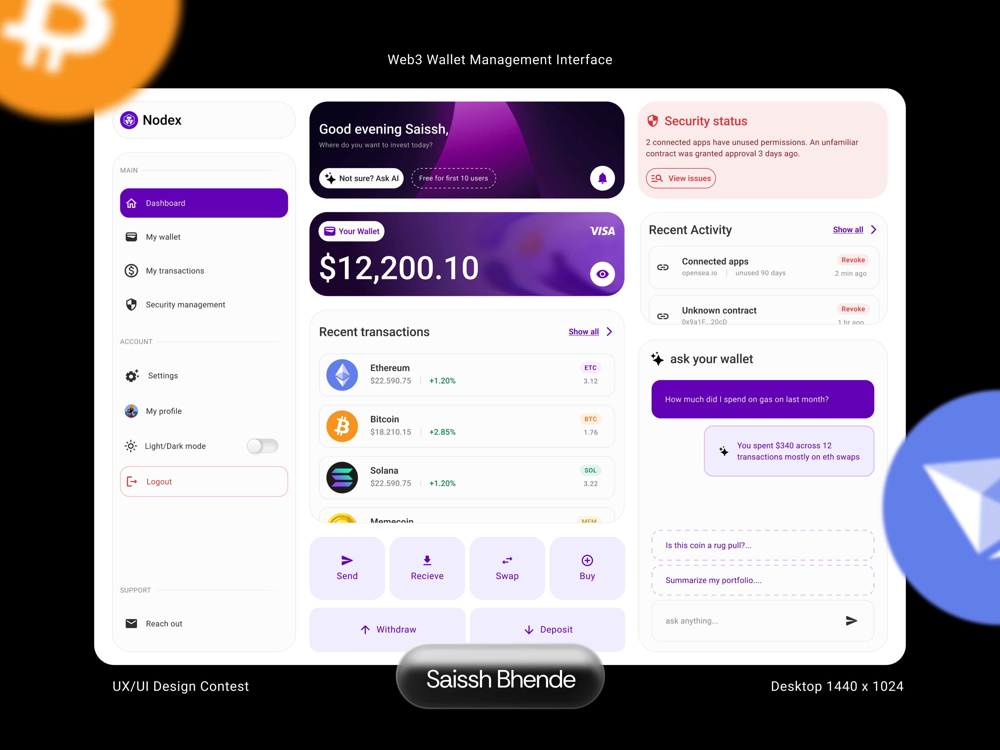

# newform-web3-wallet-design
Web3 wallet management interface designed for the NEWFORM Community design contest.

## Overview
The concept focuses on creating a simple, modern and Gen-Z-friendly experience for managing digital assets, transactions and wallet activity.

## Design Approach
- Simple 
- Gen-Z Friendly 
- Modern Web3 Aesthetic
- Consistent UI

## Tools 
- Figma

## Role
- UX/UI Designer

## Credits
- Designed by Saissh Bhende for the NEWFORM Community design contest.
  
## Final Design

